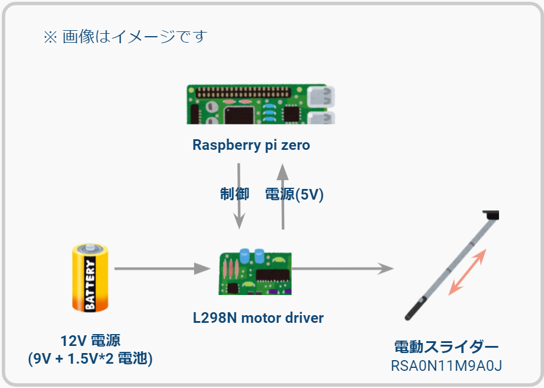

# COCONOMASK デバイス

## 説明

COCOA の信号を受信し、マスクの開閉を行います。COCOA の API は認証された組織しか使用できないため、API を経由せず直接 Service UUID を読み込んで判断しています。公式 Docs より、COCOA の Service UUID は１６進数で`fd6f`です。また、変数 age によってマスクの長さを調節します。

- 出典：https://blog.google/documents/70/Exposure_Notification_-_Bluetooth_Specification_v1.2.2.pdf/
  

## ハードについて

### 部品

- 制御：raspberry pi zero
- モーター制御：L298N
- 電動スライダー：RSA0N11M9A0J
- ワイヤー（φ1mm 汎用品 左右約 400mm ずつ）
- その他部品（百均など）

### 製作費

- 部品・材料代：2000 円程度
  - raspi zero 600 円
  - 電動スライダー 1000 円
  - モータードライバー 200 円
  - 外装 400 円
  - 残りはその他部品

