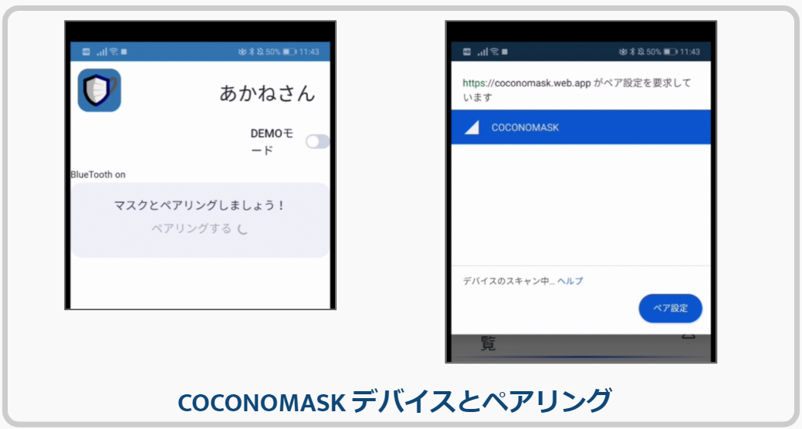
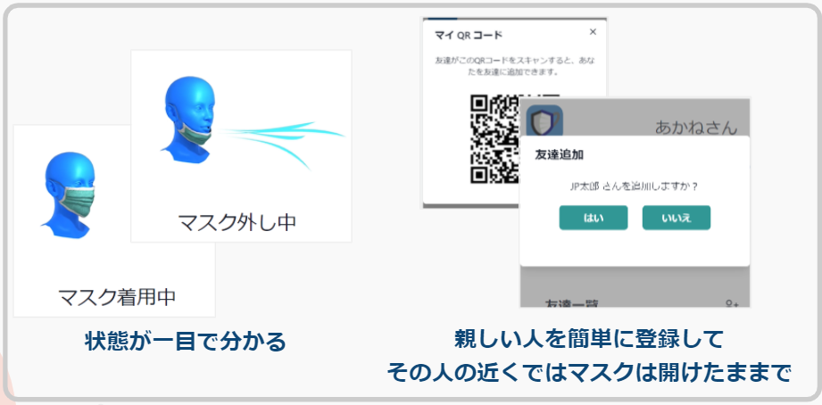

# フロントエンド

<!--  -->

<!--  -->

## 使用した技術/ライブラリ

- React.js
- yarn パッケージマネージャ
- UI に [chakra UI](https://chakra-ui.com/) を使用
- PWA（Progressive Web App） になっています
  - オフラインに対応（一部未対応）
  - バックグラウンド動作は未実装（対応中）

## 利用可能な環境

web bluetooth を使用可能な環境で全ての機能が利用できます。

※ 対応していると公言していても不具合が出る環境を観測しています。  
　 chrome（window, mac）は動作が不安定です。  
　 chrome（android）では完全な動作を確認しています。

(https://caniuse.com/web-bluetooth)

